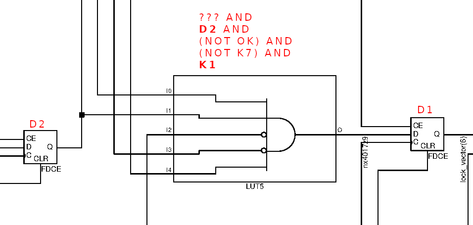
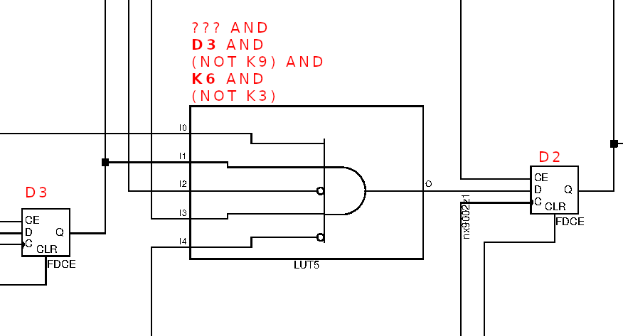
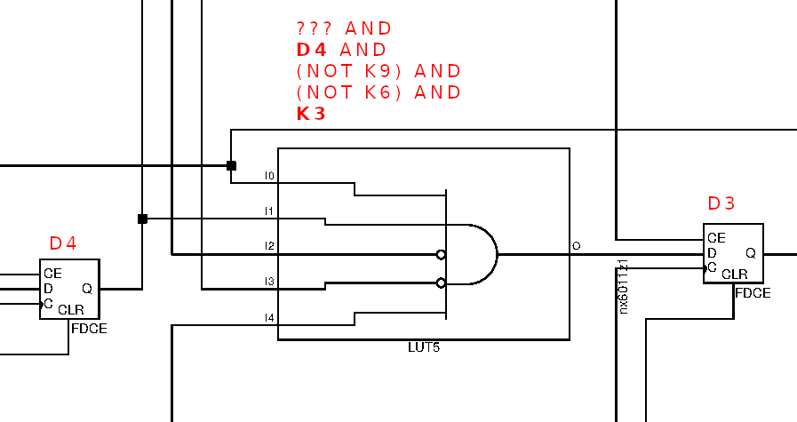
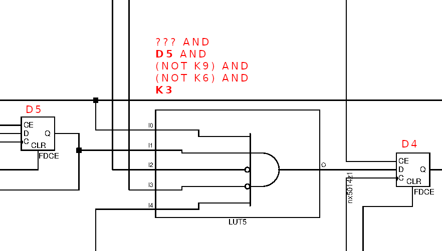
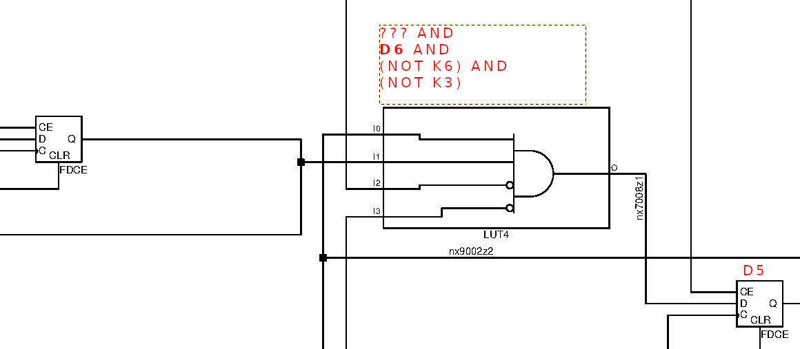
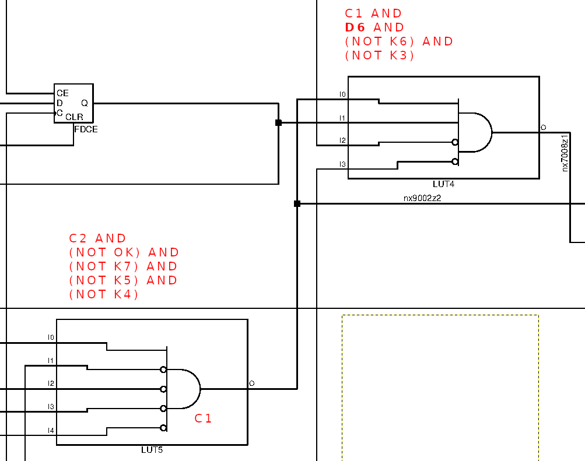
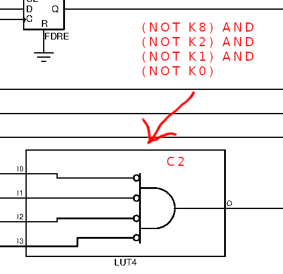
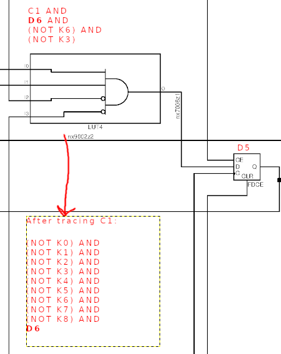
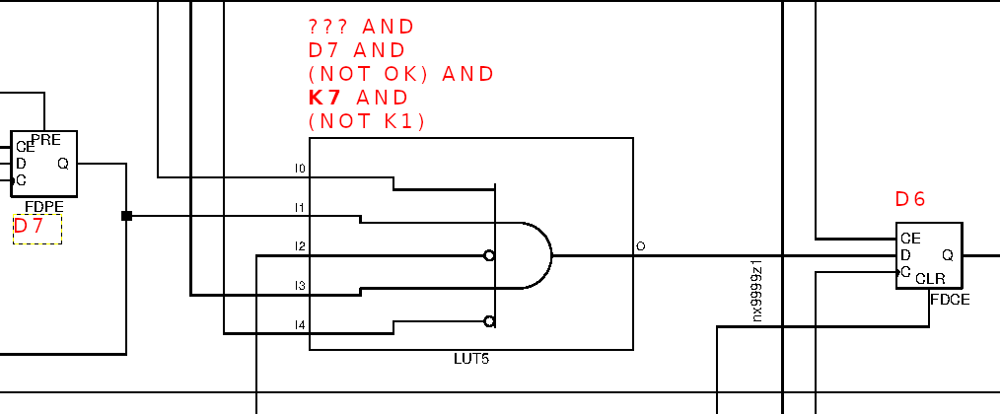

# Circuit solution

This is a tricky challenge that requires a bit of manual analysis and tracing. Basic knowledge of digital circuits is also nice to have.

We can see we have the following inputs:

* Keypad 0-9
* OK
* areset (asynchronous reset)
* clk (clock)

And one output: `unlock`

The goal is to figure out which 6 PIN needs to be entered in order for the `unlock` output to be set high. 

It's probably smart to start at the end by the unlock output, and work backwards. I'll import the schematic into GIMP at a high resolution, so we can add some notes to the schematic while solving it. I'll also be labeling d-flip-flops with D1, D2, etc., and refer to keypad inputs with K1, K2, ...

Here we can see that `unlock` is set by a register (aka D-flip-flop) I've labeled `OUT`. The value of that reigster is set by the input `D`, which comes from the component labeled `LUT2`. LUT is short for lookup table, and in this case it's a simple AND gate. The first input is simply from the register to the left, labeled `D1`. The second input is the `OK` line. So, now we know that for the door to unlock, `D1` must be set to `1` and the OK button must be pressed. Now we just need to figure out what needs to happen for `D1` to be set high. This is the technique we'll use to work backwards through the circuit and find the PIN.

Let's look at what comes before `D1`:

`D1` is set by an AND gate with 5 inputs. I've labeled four of the inputs by tracing the lines. The top input comes from another series of intricate LUTs, so for now, let's see if we can get away with not knowing the precise state needed for that line to be high.
The rest of the inputs shows us that we need the register `D2` and the `K1` (keypad button 1) to be high in order for `D1` to be set high! Now we're getting somewhere, we know that the last thing to happen before the door unlocks is for the OK button to be pressed, and before that the keypad 1 button must be pressed! Meaning, 1 is the last digit in the PIN! Let's keep going:

The inputs for `D2` show a similar pattern, we need at least `D3` and `K6` to be high for `D2` to be set high. Again we have a complex input at the top that I've ignored for now, but whatever it is, it cannot change the fact that keypad 6 must be pressed for `D2` to be set high. Let's look at the input for `D3`:

Same pattern. We need `D4` and `K3`. So far, we have the PIN code: xxx361!

Another 3! For `D4` to be set high, we need `D5` and `K3` to be high. PIN: xx3361

Aaand here the pattern breaks... The input for `D5` is not a nice combination of a register and a keypad button. It looks like we're going to have to trace the input I've labeled `???` for this one. Let's call that input `C1` and see where it comes from:

`C1` is a combination of some negated input lines, as well as yet another LUT, called `C2`:

Okay, now we've collected all the inputs for `D5`, let's recap:

So, while we still don't have a non-negated keypad input as part of the AND equation, we can, by the process of elimination see that the only keypad press that can progress the circuit is `K9`. So, we now have the PIN: x93361. Let's look at the inputs for `D6`.

Here we're back top the normal pattern, and we see that `K7` needs to be pressed to set `D6` high! It does also have the input `D7`, but what's before here doesn't matter much to us, as we've deduced the following:

1. OK and `D1` must be high for `unlock` to be set high
1. `D2` and `K1` must be high for `D1` to be set high
1. `D3` and `K6` must be high for `D2` to be set high
1. `D4` and `K3` must be high for `D3` to be set high
1. `D5` and `K3` must be high for `D4` to be set high
1. `D6` and `K9` must be high for `D5` to be set high
1. `D7` and `K7` must be high for `D6` to be set high

So, the PIN is 793361! QED.

Hope you enjoyed, I know this one was a bit of a pain to solve, but I also hope it was a fun twist on the normal CTF challenges. 
I created this schematic by designing the keypad in VHDL, and compiling and synthesizing it through Precision from Mentor Graphics. 
I originally intended to create a VHDL task where you needed to do some sort of simulation, but unfortunately the free/open source offerings for VHDL simulation seem to be a bit limited, and didn't have time to learn new software to see if it could be done using free tools. Maybe next time!
