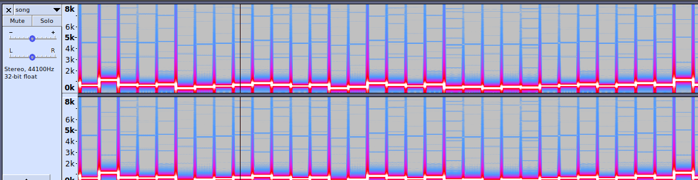

# The Bops and the Beeps solution

Download: [song.wav](song.wav)

The audio file consists of somewhat random "notes", played one at a time.
The fact that it sounds a bit random could indicate the the notes represent some kind of data.

Looking at the spectogram in audacity, we see that each note lasts for 0.1 seconds. It's hard to get useful data from this view though, so we'll have to write some code to measure every note, so we can see how many different ones there are and if they relate to each other in some way. Note that the notes overlap slightly. We'll want to filter that out in the code to get good data.




Python has the `wave` package in the standard library which can read wav-files. We also swipe a Fast Fourier Transform (fft) function from google, to be able to get the frequency of the sound from the raw data. After calculating the average frequency of a note, we divide by 10 and round to filter out minor differences.

```python3
#!/usr/bin/env python3

import numpy as np
import wave

def fft(data=None,trimBy=10,logScale=False,divBy=100,fs=32000,chunk=2048):
        left,right=np.split(np.abs(np.fft.fft(data)),2)
        ys=np.add(left,right[::-1])
        if logScale:
            ys=np.multiply(20,np.log10(ys))
        xs=np.arange(chunk/2,dtype=float)
        if trimBy:
            i=int((chunk/2)/trimBy)
            ys=ys[:i]
            xs=xs[:i]*fs/chunk
        if divBy:
            ys=ys/float(divBy)
        return xs,ys

obj = wave.open('song.wav','r')
while obj.tell() < obj.getnframes():
    # Read 0.1 seconds at a time
    data = obj.readframes(4410)
    # Filter out start and end of note (because of overlap noise)
    data = data[441*4:len(data)-441*4]
    chunk = len(data)
    data = np.fromstring(data, np.int16)
    # Get frequencies (ys) and their strength (xs) through a fft
    xs, ys = fft(data=data, fs=obj.getframerate(), chunk=chunk)
    # Get weighted average freuency (might work to just get the strongest freq)
    avg = np.average(ys, weights=xs)
    print(round(avg / 10))
obj.close()
```

Looking at the output from this there are a few values that occur several times. We can sort and filter out duplicates on the command line:

```bash
./get_freq.py | sort -n | uniq -c
      1 0
     18 30
      7 33
     24 37
     11 41
     23 44
     16 48
     51 52
     28 56
      4 59
     11 63
      3 67
      3 71
      5 74
      4 78
      5 82
     15 85
      1 268
```

This shows 18 different values, however two of them (0 and 268) are outliers and only occur once, thus are probably incorrect. Ignore those, we have 16 different values, which the keen eye will notice is a power of 2! 

If you want to encode data as some other set of symbols, you'll want to split it up into a certain number of bits per symbol. If we assume a note is a symbol, we see here that there are 16 (2^4) different symbols, meaning each symbol could represent 4 bits of data!

The easiest way to do this would be to have the lowest note, 30, represent 0000 (0).
The next one, 33, represent 0001 (1), and so on until the highest note, 85, which could represent 1111 (15).

We output all the symbols into a file: `./get_freq.py > notes.txt`, and delete the outliers 0 and 268 from that file. Then, we write a quick python script to assemble the data 4 bits at a time:

```python3
#!/usr/bin/env python3

mapping = {
        "30": 0,
        "33": 1,
        "37": 2,
        "41": 3,
        "44": 4,
        "48": 5,
        "52": 6,
        "56": 7,
        "59": 8,
        "63": 9,
        "67": 10,
        "71": 11,
        "74": 12,
        "78": 13,
        "82": 14,
        "85": 15
        }


f = open('notes.txt', 'r')
notes = [l.strip() for l in f.readlines()]
f.close()

data = ''
for i in range(0,len(notes),2):
    # Use the first symbol for the least significant bits,
    # and the second symbol for the most significant bits in this byte.
    data += chr(mapping[notes[i]] | (mapping[notes[i+1]] << 4))
print(data)
```

Run this, and the flag pops out in the terminal!
